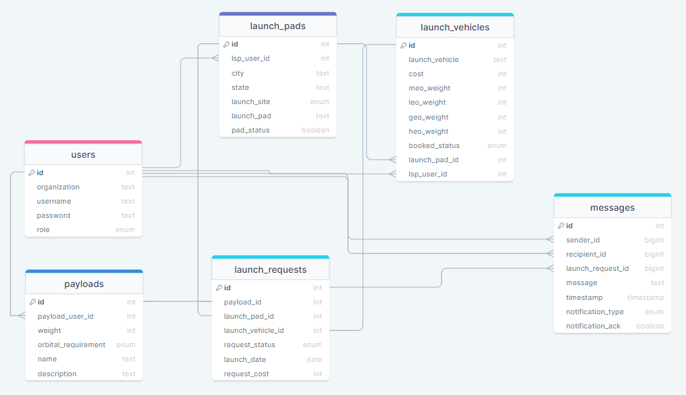

## Launch Über

&emsp; Launch Über seeks to bring government payload customers to Launch Service Providers that have the available infrastructure and schedules for launching these payloads. 

## Table of Contents
- Installation
- Description
- Usage
- Database ERD
- Team Members

## Installation
- Ensure docker is running on your machine. 
- Once in VS Code, access the `front-end` and `back-end` in seperate terminals from `Launch_App` 
 - Run `npm install` in the `front-end` terminal and `npm install nodemon` in the `back-end` terminal. 
- From the `back-end` terminal, run `npm run spinup`.
  - This will install the dockerized container for postgres and the database for the app and start the container. 
  - If you do not have a postgres image, it will be installed. This may take some time depending on your machine.
- Lastly, run `npm start` in both terminals to start the app and servers. 
- Congratulations! You have installed the Launch Über app on your machine.

## Description

Launch Service Providers and Government Customers, or Payload Users, will be the user profile types. within our App. 

- A Payload User is able to create payloads and request that they are launched with a specific Launch Vehicle,  Site, Pad, and on a specified date. 

- A Launch Service Provider(LSP) will be able to view these Launch Requests and either approve and schedule or deny them. They can also update statuses  of and add new Launch Vehicles and Pads to their profile.

Once the Request has been approved and scheduled, the Payload will be marked on a calendar for the LSP to view.

## Usage
&emsp; Once you access Launch Über, you will be prompted to login or sign-up
**Login**
- Once you type your Username and Password, you will be sent to your profile page.

**Sign Up**
- This page will have you make a username and password and specify if you are a Payload User or an LSP.

 **LSP Profile**
- From here you can add a new Launch Vehicle or Pad and check your Launch requests. 
- Once a request is accessed, you are able to Approve and Schedule it on the Calendar that also displays upcoming launches and unavailablities.
- If the LSP denies the request, they are able to add a message as to why it was denied.

**Payload User Profile**
- The Payload User will be able to create Payloads and Launch Requests. 
- They are also able to get updated statuses on their requests once they have been scheduled or denied by the LSP. 

## Database ERD

  

## Team Members
- Mack Nickle
- Isaac Pringle
- Ty Hancock
- Kyle Mersinger
- Joey Oscasio
- Khoa Nguyen

